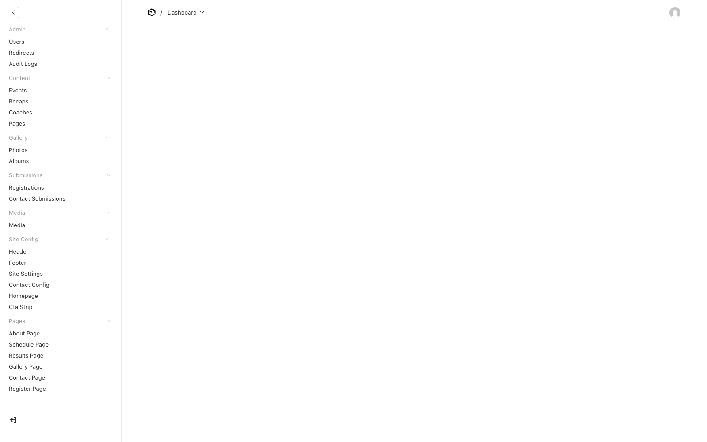
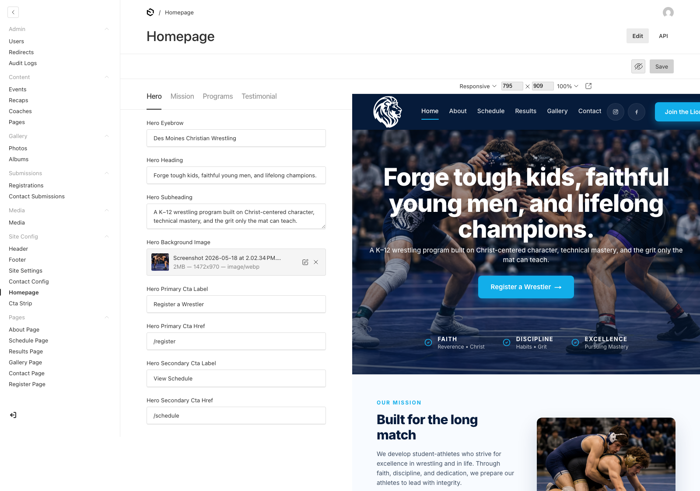
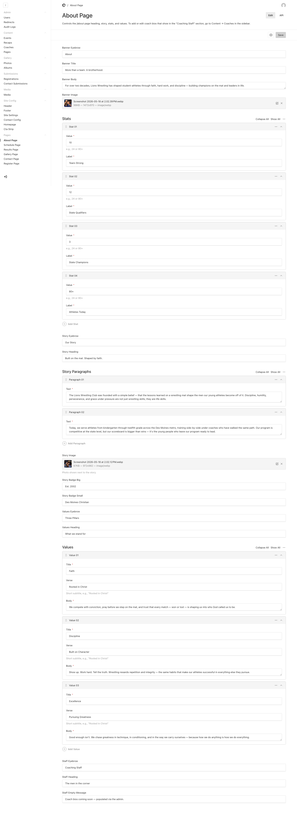
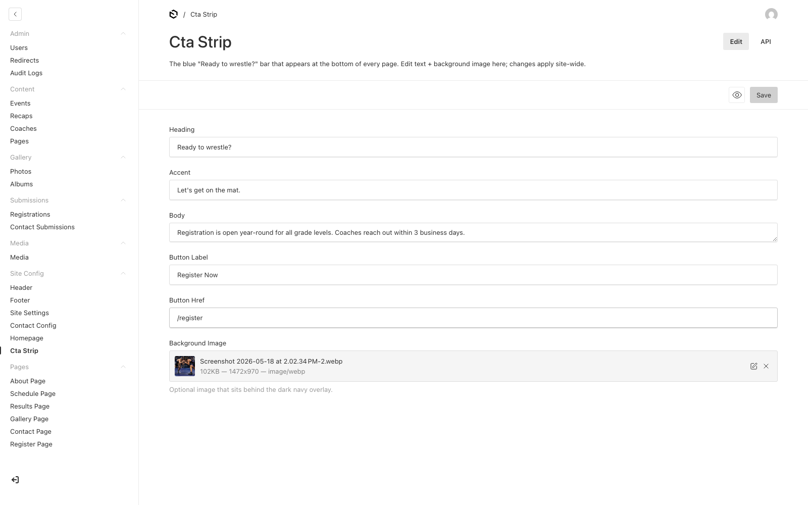
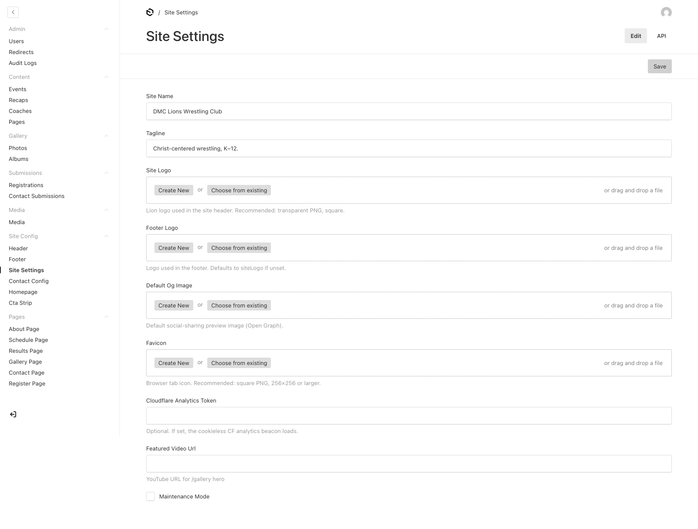
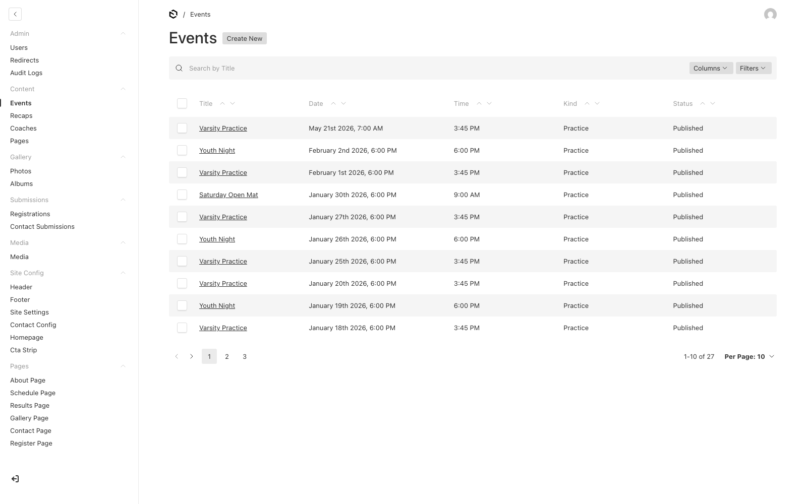
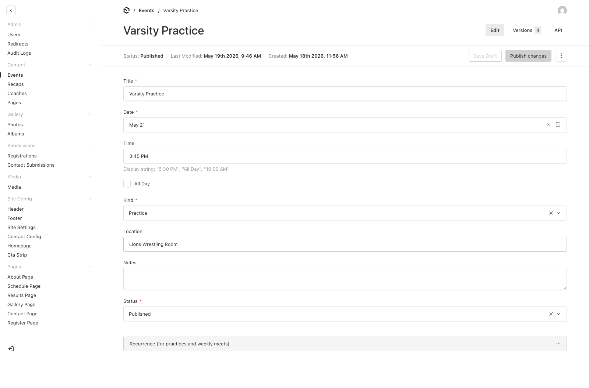
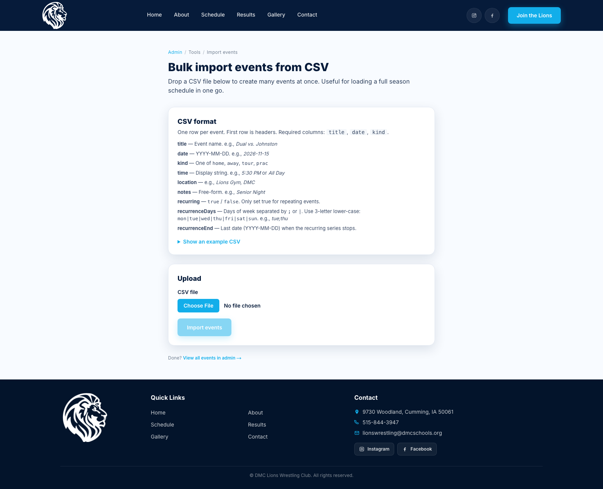
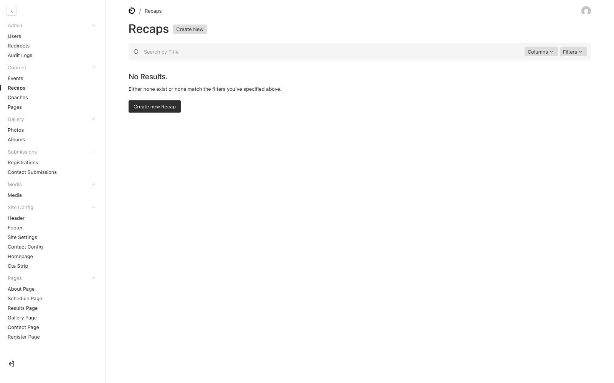
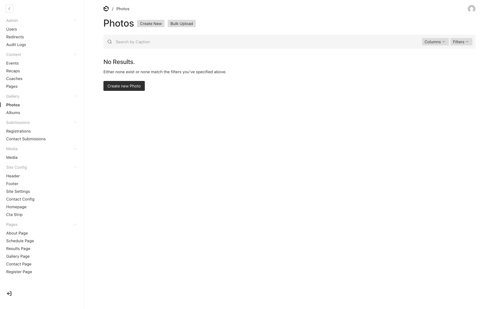

# Lions Wrestling — Admin Guide

A coach's reference for editing every part of the website. No code knowledge required.

**Login URL:** https://lwc-theta.vercel.app/admin
**Live site:** https://lwc-theta.vercel.app

---

## Table of contents

1. [Logging in](#1-logging-in)
2. [What you see when you log in](#2-what-you-see-when-you-log-in)
3. [Editing page content — three ways](#3-editing-page-content--three-ways)
4. [Edit the Homepage](#4-edit-the-homepage)
5. [Edit the About / Schedule / Results / Gallery / Contact / Register pages](#5-edit-the-inner-pages)
6. [Edit the CTA bar (every page footer)](#6-edit-the-cta-bar)
7. [Site-wide: logo, favicon, site name, tagline](#7-site-wide-settings)
8. [Add or edit events (matches, tournaments, practices)](#8-events)
9. [Recurring events (weekly practice, etc.)](#9-recurring-events)
10. [Bulk-import events from CSV](#10-bulk-import-events-from-csv)
11. [Add or edit coaches](#11-coaches)
12. [Add or edit match recaps (Results page)](#12-recaps)
13. [Upload photos to the Gallery](#13-photos)
14. [Upload media for hero / banner images](#14-media)
15. [View form submissions (contact + registration)](#15-form-submissions)
16. [Saving + publishing](#16-saving)
17. [If something goes wrong](#17-troubleshooting)

---

## 1. Logging in

Visit **https://lwc-theta.vercel.app/admin** in your browser. You'll see this:



Enter your email + password and click **Login**.

---

## 2. What you see when you log in

The left sidebar is your map. Sections are grouped:

- **Admin** — Users, redirects, audit logs (rarely needed)
- **Content** — Events, recaps, coaches, custom pages
- **Gallery** — Photos and albums
- **Submissions** — Contact form messages + registrations from parents
- **Media** — Image library
- **Site Config** — Header, Footer, Site Settings, Contact Config, Homepage, **CTA Strip**
- **Pages** — About / Schedule / Results / Gallery / Contact / Register

> 💡 **Tip:** Anything in "Pages" controls the heading/intro of that page. The list items on that page (events, recaps, photos, coaches) live in the matching "Content" or "Gallery" collection.

---

## 3. Editing page content — three ways

1. **Forms (classic)** — Open a page in the sidebar, type into the fields, click **Save**.
2. **Live Preview (recommended)** — Open a page, click the **👁 eye icon** next to Save. The right pane shows your live site. Edit on the left → preview updates automatically.
3. **Inline editing (fastest)** — Open Live Preview. Click any text or hero photo *in the preview itself*. Type to replace, click away to save.


> 🟦 In Live Preview, hovering over editable text shows a dashed cyan outline. Hovering over a hero image shows a "Click to replace image" overlay.

---

## 4. Edit the Homepage

In the sidebar: **Site Config → Homepage**.



The Homepage has 4 tabs:

- **Hero**
  - Hero Eyebrow — Small label above the title
  - Hero Heading — Big title
  - Hero Subheading — Line below
  - Hero Background Image — "Choose from existing" or "Create New" to upload
  - Hero Primary Cta Label / Href — Big button
  - Hero Secondary Cta Label / Href — Outline button

- **Mission**
  - Mission Heading
  - Mission Body
  - Mission Photo

- **Programs** — 3 dark cards. Click **+ Add row** to add a 4th, **X** to remove.

- **Testimonial** — Quote, Author, Role

Click **Save** when done.

---

## 5. Edit the inner pages

Same pattern for About / Schedule / Results / Gallery / Contact / Register. In the sidebar, click **Pages → [Page name]**.



Common fields on every page:

- **Banner Eyebrow** — Small label at the top
- **Banner Title** — Main heading
- **Banner Body** — Intro paragraph
- **Banner Image** — Hero background (optional)

Plus page-specific fields:

| Page | Extra fields |
|---|---|
| About | Stats (4 numbers), Story (eyebrow/heading/paragraphs/badge), Story Image, Values (3 cards), Staff section heading |
| Schedule | Subscribe label + description, empty-state message |
| Results | Empty-state message |
| Gallery | Featured video YouTube URL, empty-state message |
| Contact | Form heading, FAQ heading, FAQ list (click "+ Add row") |
| Register | Form heading, Fees body, Requirements list |

---

## 6. Edit the CTA bar

The blue "Ready to wrestle? Let's get on the mat." bar shows on every page. Edit once, updates everywhere.

In the sidebar: **Site Config → Cta Strip**.



- **Heading** — e.g., "Ready to wrestle?"
- **Accent** — Second line in cyan
- **Body** — Paragraph
- **Button Label / Href**
- **Background Image** — Optional photo behind the dark gradient

---

## 7. Site-wide settings

In the sidebar: **Site Config → Site Settings**.



- **Site Name** — Browser tab title + footer
- **Tagline** — Default site description
- **Site Logo** — Lion logo shown in the site header (top-left)
- **Footer Logo** — Optional separate logo for footer; falls back to Site Logo
- **Default OG Image** — Social-sharing preview (Facebook, Twitter)
- **Favicon** — Browser tab icon
- **Cloudflare Analytics Token** — Optional
- **Featured Video URL** — YouTube URL for Gallery hero
- **Maintenance Mode** — Tick to take the site offline

---

## 8. Events

In the sidebar: **Content → Events**.



Click an event row to edit, or **Create New** in the top-right to add one.



Fields:

- **Title** — e.g., "Dual vs. Johnston"
- **Date** — Click for date picker
- **Time** — Display string. e.g., "5:30 PM" or "All Day"
- **All Day** — Checkbox (for the calendar feed)
- **Kind**:
  - **Home Match** — Cyan tag
  - **Away Match** — Navy tag
  - **Tournament** — Gray tag
  - **Practice** — Listed under Practices, not Matches
- **Location**
- **Notes** — e.g., "Senior Night"
- **Status** — **Published** to show, **Draft** to hide
- **Recurrence** — Collapsed by default; expand only if it repeats (next section)

Click **Save**.

---

## 9. Recurring events

For practices that happen on the same days every week.

1. Create the event normally (Date = first occurrence, Time, Kind = Practice, etc.)
2. Scroll down to the **Recurrence** section (collapsed). Click to expand.
3. **Tick the "recurring" checkbox**. Two new fields appear:
   - **Recurrence Days** — Hold Ctrl/Cmd and click multiple days (Tuesday + Thursday)
   - **Recurrence End** — Last date of the series
4. Save.

The Schedule page expands this into individual occurrences automatically.

> 💡 To turn off recurrence later: untick the checkbox.

---

## 10. Bulk-import events from CSV

For loading a full season at once.

URL: **https://lwc-theta.vercel.app/admin-tools/import-events**



### CSV format

First row is headers. **Required columns:** `title`, `date`, `kind`.

| Column | Required | Format | Example |
|---|---|---|---|
| title | yes | text | `Dual vs. Johnston` |
| date | yes | YYYY-MM-DD | `2026-11-15` |
| kind | yes | `home` / `away` / `tour` / `prac` | `home` |
| time | no | display text | `5:30 PM` or `All Day` |
| location | no | text | `Lions Gym, DMC` |
| notes | no | text | `Senior Night` |
| recurring | no | `true` / `false` | `true` |
| recurrenceDays | no | days separated by `;` or `\|` | `tue;thu` |
| recurrenceEnd | no | YYYY-MM-DD | `2027-02-28` |

Allowed `recurrenceDays` (3-letter lower-case): `mon`, `tue`, `wed`, `thu`, `fri`, `sat`, `sun`.

### Example CSV

```csv
title,date,time,kind,location,notes,recurring,recurrenceDays,recurrenceEnd
Mid-Iowa Open,2026-11-07,All Day,tour,Indianola HS,16 schools,false,,
Dual vs. Johnston Dragons,2026-11-15,5:30 PM,home,"Lions Gym, DMC",Senior Night,false,,
Varsity Practice,2026-11-03,3:45 PM,prac,Wrestling Room,,true,tue;thu,2027-02-28
Sectional Tournament,2027-02-19,10:00 AM,tour,TBD,State qualifier,false,,
```

> ⚠️ **Notes with commas or quotes:** wrap the cell in double-quotes (`"Lions Gym, DMC"`). A double-quote inside a quoted cell is written `""`.

### Upload steps

1. Save CSV from Excel / Google Sheets (File → Download → Comma Separated Values).
2. On the upload page, click **Choose file**, pick the CSV.
3. Click **Import events**.
4. Green confirmation: "Imported N events." Any failed rows are listed with the reason.

---

## 11. Coaches

In the sidebar: **Content → Coaches**.


Click **Create New** to add. Fields:

- **Name**
- **Role** — e.g., "Head Coach", "Assistant Coach"
- **Bio** — Rich text (bold, italic, lists, links)
- **Photo** — Recommended square ≥400×400
- **Email** — Direct contact link
- **Order** — Lower number = earlier in the list

---

## 12. Recaps

Match recaps shown on /results. In the sidebar: **Content → Recaps**.



Fields:

- **Title** — e.g., "Lions storm Valley HS, 52 – 18"
- **Kicker** — Small label above the title, e.g., "Home Dual"
- **Date** — When the event happened
- **Body** — Rich text (Lexical editor: bold, italic, links, lists, headings)
- **Tags** — Array of small labels shown at the bottom
- **Status** — Published / Draft

---

## 13. Photos

Photos shown on /gallery and the homepage gallery strip. In the sidebar: **Gallery → Photos**.



For each photo:

- Upload an image (JPG / PNG / WebP)
- **Alt** — Description for screen readers + SEO (required)
- **Caption** — Visible on hover
- **Featured** — Tick to show on the homepage strip
- **Date** — Used to sort

---

## 14. Media

All uploaded images live in **Media → Media**. Direct uploads (Photos and Coaches) automatically end up here.

Click any image to:
- Replace it
- Edit alt text + caption
- See where it's used

Files are stored in Vercel Blob and served via CDN.

---

## 15. Form submissions

### Contact submissions

**Submissions → Contact Submissions** — every message from /contact.

Click a row to view the full message. Mark each as:
- **New** (default)
- **Read**
- **Replied**

### Registrations

**Submissions → Registrations** — every wrestler signup from /register.

Each row has the wrestler info, parent info, and signup date. Use the API tab in the top-right to export to JSON.

---

## 16. Saving

Click **Save** in the top-right of any document editor.

Pages cache for **~10 minutes** for performance. Your edit IS saved immediately to the database — the public site just takes up to 10 min to refresh. To verify your change is live right now:

- Open Live Preview (👁 icon) — always shows fresh content
- Or open the live site in a private window (skips browser cache)

---

## 17. Troubleshooting

| Problem | Fix |
|---|---|
| "I uploaded an image but it didn't show up" | Wait up to 10 min, or hard-refresh (Cmd+Shift+R / Ctrl+Shift+R) |
| "I edited text but the live site still shows old text" | Same — cache. Use Live Preview to confirm. |
| "I can't log in" | Click "Forgot password?" to receive a reset link. |
| "White screen on /admin" | Hard refresh. If still broken, contact the dev. |
| "CSV import says rows failed" | The error tells you which row + why. Common: invalid date, invalid `kind`, missing title. |
| "Recurrence Days field isn't there" | You haven't ticked the recurring checkbox yet. |
| "I deleted something by accident" | Contact the dev; the database has point-in-time backups. |

---

## Quick reference: where each piece of the public site lives

| Public element | Edit in admin |
|---|---|
| Browser tab title + site name | Site Config → Site Settings → Site Name |
| Site header logo | Site Config → Site Settings → Site Logo |
| Top navigation menu | Site Config → Header → Nav Items |
| Footer logo + address/phone/email | Site Config → Footer |
| Footer social links | Site Config → Footer |
| Homepage hero (heading + photo) | Site Config → Homepage → Hero tab |
| Mission section | Site Config → Homepage → Mission tab |
| Program cards | Site Config → Homepage → Programs tab |
| Testimonial quote | Site Config → Homepage → Testimonial tab |
| "Ready to wrestle?" CTA bar | Site Config → Cta Strip |
| About page content | Pages → About Page |
| Coach bios | Content → Coaches |
| Schedule page intro | Pages → Schedule Page |
| Schedule events | Content → Events (or bulk-import) |
| Results page intro | Pages → Results Page |
| Match recap entries | Content → Recaps |
| Gallery page intro + featured video | Pages → Gallery Page |
| Gallery photos | Gallery → Photos |
| Contact page heading + FAQs | Pages → Contact Page |
| Contact form recipient emails + rate limit | Site Config → Contact Config |
| Register page + fees + requirements | Pages → Register Page |

---

**Questions or stuck?** Email the dev with a screenshot of what you're seeing.
